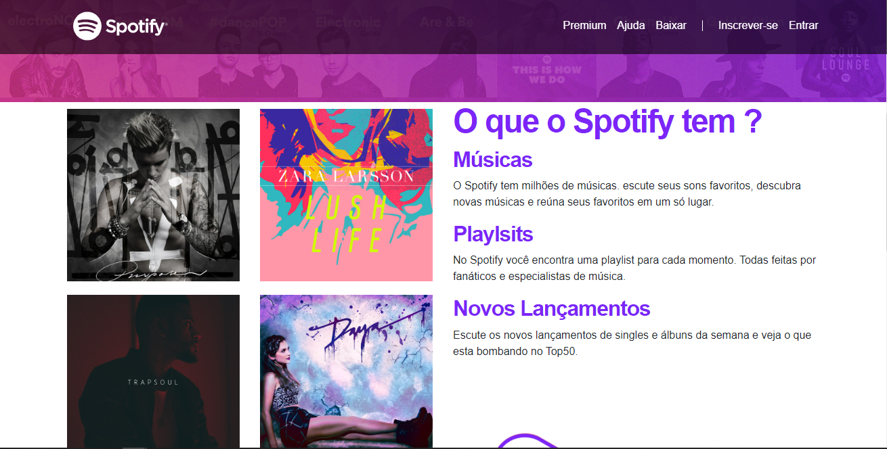

<h1 align="center"> Spotify Clone</h1>

Aplicação clone do site Spotify 

  <a href="#-tecnologias">Tecnologias</a>&nbsp;&nbsp;&nbsp;|&nbsp;&nbsp;&nbsp;
  <a href="#-projeto">Projeto</a>&nbsp;&nbsp;&nbsp;|

  

 

  

## 🚀 Tecnologias

Esse projeto foi desenvolvido com as seguintes tecnologias:

- HTML e CSS
- Bootstrap
- Git e Github

## 💻 Projeto

    Essa aplicação tem como intuito de ser um clone da pagina inicial do Spotify visando compreender conceitos avançados de Bootstrap.

- [Visite o projeto online](https://danrodriguezdev.github.io/SpotifyClone/)